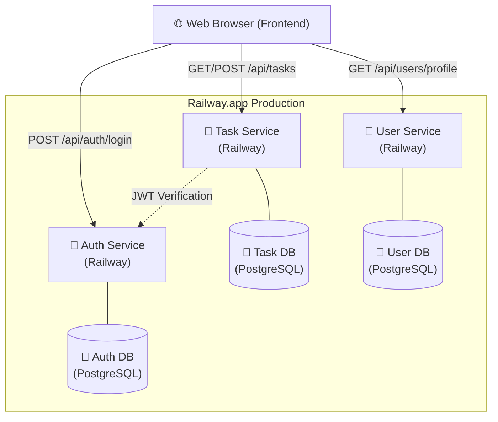

**ENGCE301 Final Lab:** [Set 1](https://github.com/achitphon09/engce301-final-lab1-67543206027-4-67543206069-6) | [Set 2](https://github.com/achitphon09/engce301-final-lab2-67543206027-4-67543206069-6)

# Microservices Scale-Up + Cloud Deploy (Railway) - Final Lab (Set 2)

## 👤 จัดทำโดย
1. **นายอชิตพล โอชารส** รหัสนักศึกษา 67543206027-4
2. **นายเมธิวัฒน์ ชมชื่น** รหัสนักศึกษา 67543206069-6

ข้อมูลเพิ่มเติมดูได้ที่ [MEMBER.md](MEMBER.md)

## URL ของ Service บน Production (Railway)

- **Auth Service**: [https://auth-service-production-559c.up.railway.app](https://auth-service-production-559c.up.railway.app)
- **Task Service**: [https://task-service-production-b94a.up.railway.app](https://task-service-production-b94a.up.railway.app)
- **User Service**: [https://user-service-production-bf73.up.railway.app](https://user-service-production-bf73.up.railway.app)

- **Frontend URL**: [https://frontend-production-ad4c.up.railway.app](https://frontend-production-ad4c.up.railway.app/)

**Bonus** Gateway nginx รวมทุก Service และ Frontend (พร้อม Rate Limit)
- **Gateway URL**: [https://gateway-production-03ed.up.railway.app](https://gateway-production-03ed.up.railway.app/)

## Screenshots
- [1 - Railway Dashboard](screenshots/01_railway_dashboard.png)
- [2 - Auth Register Cloud](screenshots/02_auth_register_cloud.png)
- [3 - Auth Login Cloud](screenshots/03_auth_login_cloud.png)
- [4 - Task Create Cloud](screenshots/04_task_create_cloud.png)
- [5 - Task List Cloud](screenshots/05_task_list_cloud.png)
- [6 - User Profile Cloud](screenshots/06_user_profile_cloud.png)
- [7 - User Profile Update Cloud](screenshots/07_user_profile_update_cloud.png)
- [8 - Task No JWT 401](screenshots/08_task_no_jwt_401.png)
- [9 - Railway Env Variables](screenshots/09_railway_env_variables.png)
- [10 - Readme Architecture](screenshots/10_readme_architecture.png)

## Phase 5: Gateway Strategy

มีการใช้งานทั้ง **Option A** และ **Option B** รวมถึง **Bonus** ตามข้อกำหนดของโจทย์

### Option A (Frontend เรียก URL ของแต่ละ service โดยตรง)
- **Frontend** มีการชี้ Environment Variables (`AUTH_API`, `TASK_API`, `USER_API`) เพื่อยิงหน้าเว็บหาแต่ละ Microservice โดยตรง

### Option B (สร้าง API Gateway บน Railway เพื่อ Route Traffic) และ Bonus
- มีการใช้ **Nginx** ทำหน้าที่เป็น **Gateway** รวมทุก Service และ Frontend เข้าด้วยกันเป็น URL เดียวลดปัญหา CORS
- **Bonus**: เพิ่มการคอนฟิก **Rate Limit** ภายใน Nginx Gateway เพื่อป้องกันการสแปมและโจมตีเบื้องต้น

---

## คำสั่งที่ใช้ในการทดสอบ
### Register
```sh
curl -X POST https://auth-service-production-559c.up.railway.app/api/auth/register \
  -H "Content-Type: application/json" \
  -d '{"username":"myuser","password":"mypass","email":"my@email.com"}'
```

### Login → เก็บ token
```sh
TOKEN=$(curl -s -X POST https://auth-service-production-559c.up.railway.app/api/auth/login \
  -H "Content-Type: application/json" \
  -d '{"email":"alice@lab.local","password":"alice123"}' | jq -r '.token')
```

### Create Task
```sh
curl -X POST https://task-service-production-b94a.up.railway.app/api/tasks \
  -H "Authorization: Bearer $TOKEN" \
  -H "Content-Type: application/json" \
  -d '{"title":"My first cloud task"}'
```

### Get Profile
```sh
curl https://user-service-production-bf73.up.railway.app/api/users/profile \
  -H "Authorization: Bearer $TOKEN"
```

### Test 401
```sh
curl https://task-service-production-b94a.up.railway.app/api/tasks   # ไม่ใส่ token → ต้องได้ 401
```

---

## ☁️ สถาปัตยกรรมระบบ (Cloud Architecture)



---

## 🛠️ ปัญหาที่เจอระหว่างทำ + วิธีแก้

| ปัญหา | สาเหตุ | วิธีแก้ไข |
|---|---|---|
| **CORS Error** | Frontend เรียกข้าม Service (Auth/User/Task) บน Railway | ตั้งค่า Middleware `cors` ในทุก Service ให้รองรับ URL ของ Frontend |
| **JWT Invalid** | ค่า `JWT_SECRET` ในแต่ละ Service ไม่ตรงกัน | ตั้งค่า Environment Variable `JWT_SECRET` บน Railway ทุก Service ให้เป็นค่าเดียวกัน |
| **Database Connection** | ระบบหา Hostname ของ DB ไม่เจอเมื่อรันบน Local vs Cloud | ใช้ `DATABASE_URL` ที่ Railway กำหนดให้ใน Environment และคุมผ่าน `.env` |
| **Profile Not Found** | ตอน Login ครั้งแรกยังไม่มีข้อมูลในตาราง `user_profiles` | ตรวจสอบ Logic ใน User Service ให้ทำ Auto-Create หรือ Manual Seed ข้อมูล Profile เริ่มต้น |
