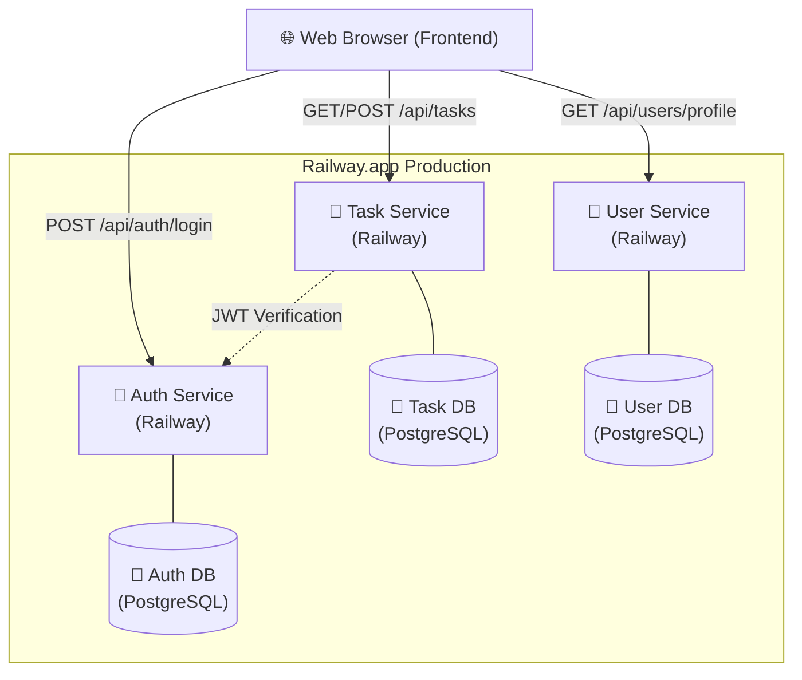

# engce301-final-set2

## URL ของ Service บน Production (Railway)

- **Auth Service**: [https://auth-service-production-559c.up.railway.app](https://auth-service-production-559c.up.railway.app)
- **Task Service**: [https://task-service-production-b94a.up.railway.app](https://task-service-production-b94a.up.railway.app)
- **User Service**: [https://user-service-production-bf73.up.railway.app](https://user-service-production-bf73.up.railway.app)

## Phase 5: Gateway Strategy

### วิธีที่เลือก: Option A (Frontend เรียก URL ของแต่ละ service โดยตรง)

**เหตุผลที่เลือก:**
- **ความง่าย (Simplicity)**: เป็นวิธีที่ง่ายที่สุดในการติดตั้ง เนื่องจากไม่ต้องตั้งค่า API Gateway หรือใช้ Nginx เป็น reverse proxy เพิ่มเติมบนสภาพแวดล้อม production
- **การเข้าถึงโดยตรง**: แต่ละ service สามารถเข้าถึงได้โดยตรงผ่าน URL สาธารณะที่ Railway กำหนดให้
- **ความเหมาะสม**: สำหรับขอบเขตของโปรเจกต์และสถาปัตยกรรม microservices บน Railway ในขณะนี้ วิธีนี้ตอบโจทย์ความต้องการโดยใช้ทรัพยากรน้อยที่สุด

---

## คำสั่งที่ใช้ในการทดสอบ
### Register
```sh
curl -X POST https://auth-service-production-559c.up.railway.app/api/auth/register \
  -H "Content-Type: application/json" \
  -d '{"username":"myuser","password":"mypass","email":"my@email.com"}'
```

### Login → เก็บ token
```sh
TOKEN=$(curl -s -X POST https://auth-service-production-559c.up.railway.app/api/auth/login \
  -H "Content-Type: application/json" \
  -d '{"username":"myuser","password":"mypass"}' | jq -r '.token')
```

### Create Task
```sh
curl -X POST https://task-service-production-b94a.up.railway.app/api/tasks \
  -H "Authorization: Bearer $TOKEN" \
  -H "Content-Type: application/json" \
  -d '{"title":"My first cloud task"}'
```

### Get Profile
```sh
curl https://user-service-production-bf73.up.railway.app/api/users/profile \
  -H "Authorization: Bearer $TOKEN"
```

### Test 401
```sh
curl https://task-service-production-b94a.up.railway.app/api/tasks   # ไม่ใส่ token → ต้องได้ 401
```

---

## ☁️ สถาปัตยกรรมระบบ (Cloud Architecture)



---

## 🛠️ ปัญหาที่เจอระหว่างทำ + วิธีแก้

| ปัญหา | สาเหตุ | วิธีแก้ไข |
|---|---|---|
| **CORS Error** | Frontend เรียกข้าม Service (Auth/User/Task) บน Railway | ตั้งค่า Middleware `cors` ในทุก Service ให้รองรับ URL ของ Frontend |
| **JWT Invalid** | ค่า `JWT_SECRET` ในแต่ละ Service ไม่ตรงกัน | ตั้งค่า Environment Variable `JWT_SECRET` บน Railway ทุก Service ให้เป็นค่าเดียวกัน |
| **Database Connection** | ระบบหา Hostname ของ DB ไม่เจอเมื่อรันบน Local vs Cloud | ใช้ `DATABASE_URL` ที่ Railway กำหนดให้ใน Environment และคุมผ่าน `.env` |
| **Profile Not Found** | ตอน Login ครั้งแรกยังไม่มีข้อมูลในตาราง `user_profiles` | ตรวจสอบ Logic ใน User Service ให้ทำ Auto-Create หรือ Manual Seed ข้อมูล Profile เริ่มต้น |
